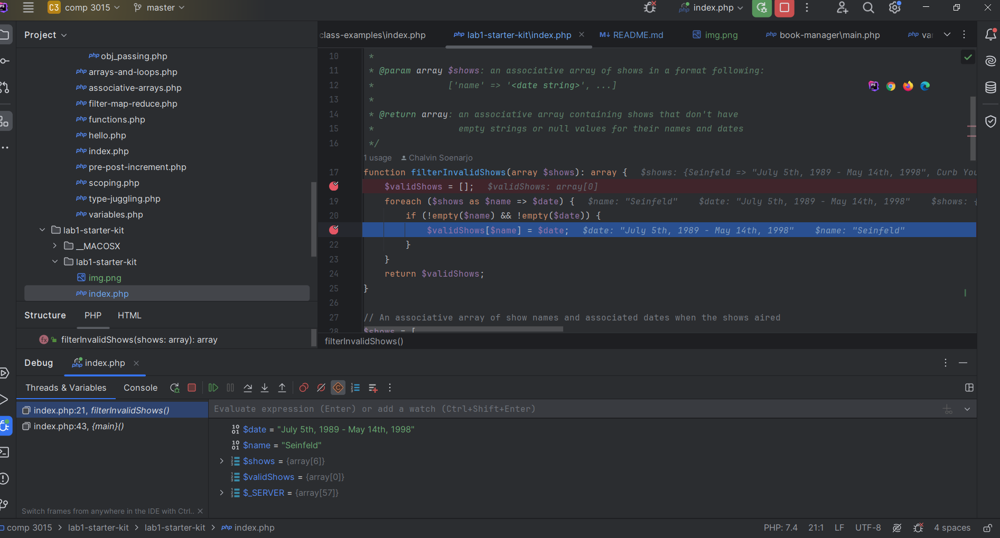

# COMP 3015, Lab 1

### Running the program using the built-in PHP development server:

```
php -S localhost:8000
```

With the above command running you should then be able to access http://localhost:8000/main.php in your web browser.

I renamed main.php to index.php so that php -S localhost:8000 can run
the code in from main.php

Screenshot of using Xdebug paused on a breakpoint (below)




